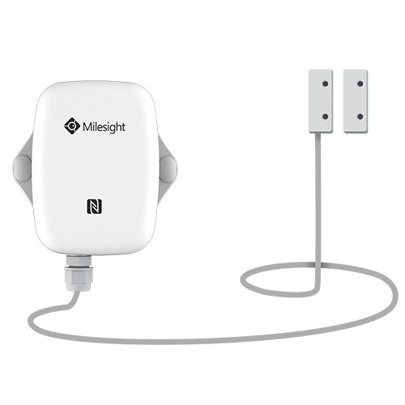

# Milesight EM300-MCS - Magnetic Contact Switch


Deze payload decoder is voor de Milesight EM300-MCS.

Voor meer informatie bezoek (https://wwww.delmation.nl).


## Payload Definitie

 ```
                    [channel_id] [channel_type] [channel_value]
 01: battery      -> 0x01         0x75          [1byte ] Unit: %
 03: temperature  -> 0x03         0x67          [2bytes] Unit: °C
 04: humidity     -> 0x04         0x68          [1byte ] Unit: %
 06: hall         -> 0x05         0x00          [1byte ] Unit:

 ```

## Voorbeeld voor The Things Network v3

**Payload**
```
01 75 5C 03 67 B6 00 04 68 5B 06 00 01
```


**Data Segmentation**

   - `01 75 5C`
   - `03 67 B6 00`
   - `04 68 5B`
   - `06 00 01`


**Output**

 ```json
{
  "battery": 92,
  "temperature": 18.2,
  "humidity": 45.5,
  "hall": 1
}
 ```
